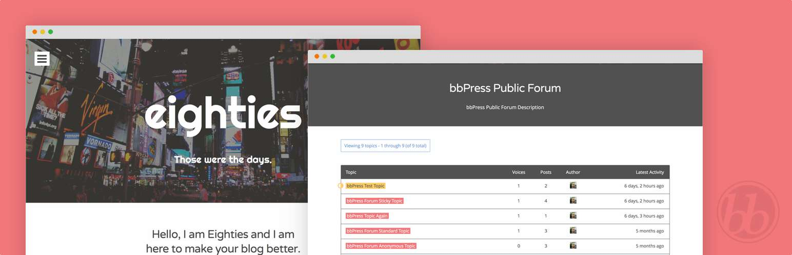

# Eighties Add-on - bbPress



An add-on for the [Eighties WordPress theme](http://eighties.me) that adds [bbPress](http://bbpress.org) integration. More specifically, this addon adds  custom bbPress styles and templates for the theme.

## Installation

By default the _Eighties bbPress_ add-on just works. All you need to do in order to begin using it is activate the add-on and the Eighties theme.

### Using The WordPress Dashboard (Recommended)

1. Navigate to *Plugins → Add New* from within the WordPress Dashboard.
2. Search for `eighties bbpress`.
3. Click **Install Now** on *Eighties bbPress* by Justin Kopepasah
4. Activate the plugin.

### Uploading in WordPress Dashboard

1. Navigate to *Plugins → Add New* from within the WordPress Dashboard.
2. Click on the **Upload** link underneath the *Install Plugins* page title.
3. Click the **Browse...** button and choose `eighties-bbpress.zip` in its download location on your computer.
4. Click the **Install Now** button.
5. Activate the plugin.

### Using FTP (Not Recommended)

1. Download `eighties-bbpress.zip`.
2. Extract the `eighties-bbpress` directory to your computer.
3. Upload the `eighties-bbpress` directory to your `/#CONTENT#/plugins/` directory.
4. Navigate to *Plugins → Installed Plugins* and activate the plugin.

## Usage

Eighties Add-on bbPress will only work if both Eighties (theme) and bbPress (plugin) are active. The two work together, seamlessly.

### Customization

Eighties Add-on bbPress follows the bbPress model of [customizing templates](http://codex.bbpress.org/theme-compatibility/step-by-step-guide-to-creating-a-custom-bbpress-theme/). For example, copying a template file over to your theme (or child theme, because you are using Eighties) from the add-on will override the template file for the add-on.

The bbPress template files for the add-on are located here:

```
eighties-bbpress/templates/bbpress
```

